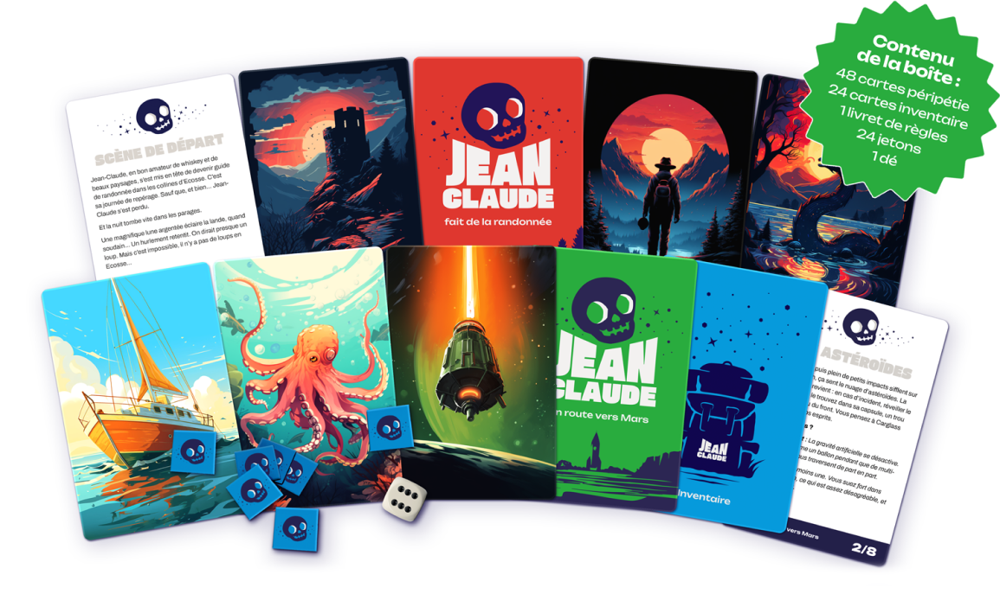

---
blocks:
  questions:
    - question: "Comment on joue ?"
      answer: |
        Chaque partie de Jean Claude est une aventure constituée de six péripéties, racontées par l’un des joueurs, qui endosse le rôle de Maître de Jeu. Le plus simple, c’est de choisir le joueur qui aime bien raconter des choses.

        Ce sont les solutions trouvées et racontées par les autres joueurs qui vont rendre l’aventure de Jean Claude unique.
    - question: "C’est long une partie de Jean Claude ? (non) (enfin ça dépend) (mais en général non)"
      answer: |
        Une partie de Jean Claude demande environ zéro préparation, pour des règles expliquées en moins de 3 minutes, un nombre de joueurs variant de 2 à plein et une durée d’à peu près une demie heure (plus si les joueurs sont intarissables).
    - question: "Ha très bien, et comment vous est venue cette idée ?"
      answer: |
        On est convaincus que les histoires ont le pouvoir de nous rapprocher.

        Et que tout le monde a le pouvoir d’en raconter.

        Alors on a inventé Les Aventures de Jean Claude, le jeu qui libère votre imagination.
---
## On ne meurt que plein de fois

Dans une partie de Jean Claude, les joueurs prennent en main le destin de Jean Claude, héros ordinaire confronté à une série de périls tout à fait extraordinaires. Chacun leur tour, les joueurs vont raconter comment Jean Claude a échappé à une mort certaine. 

Parfois ça marche. Parfois non.

Jean Claude va mourir. Et pas qu’un peu.

<!-- break -->

## Et sinon, je me demandais, pourquoi le personnage s’appelle Jean Claude ?

C’est une très bonne question.
N’hésitez pas à nous la poser en nous contactant :

## Nous contacter

Vous voulez participer à un playtest ? Vous voulez en organiser un ?
Vous avez une question, besoin d’infos, une idée soudaine, un truc à nous raconter ou des choses à nous dire ?

Envoyez nous un mail à <contact@jeanclaude-aventures.com>.

## Jean Claude est un jeu (bientôt) édité par les Éditions Univers Détendu, conçu à 8 mains par [Damien Barré](https://damien.super.site), [Cyril Rimbaud](https://curiouser.fr/curiouser/lequipe/), [Olivier Ravard](https://www.linkedin.com/in/mrolivier/) et [Cécile Ricordeau](https://www.cecillie.fr){.text-neutral-400}
